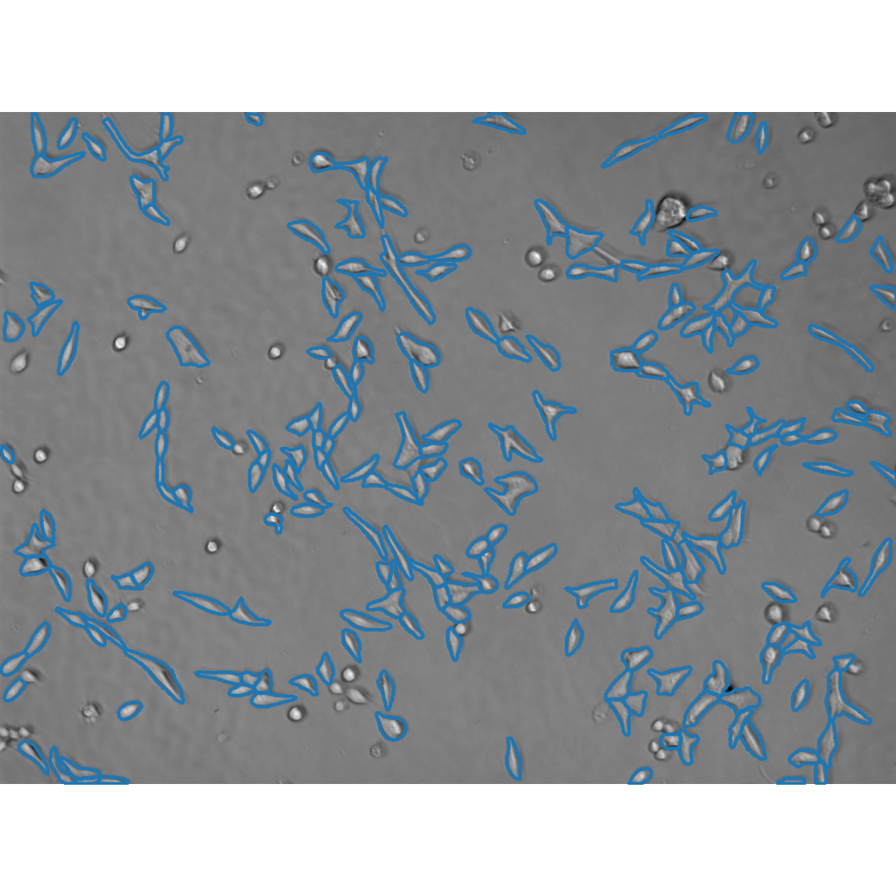

# cell_counting_app

## Overview
細胞画像を自動解析し、細胞数をカウントするアプリケーションです。
研究作業におけるカウントの自動化・安定化を目的として開発しました。

## Features
- ローカルPython環境の検出
- 必要ライブラリの自動インストール
- GUIからの画像フォルダ選択
- 細胞画像の自動解析・カウント
- 細胞サイズなどの解析パラメータ調整
- 複数画像の一括処理

## Motivation
薬剤によるがん細胞の増殖抑制効果を検証するため、視野内の細胞数を経時的に追跡する必要がありました。
取得した各視野・各時間帯の画像について、簡便に、尚且つ人為的なバイアスを排除してカウントすることを目的として、開発しました。
また、研究室内での共有・各種媒体への移植を簡易化するため、アプリケーションの形に落とし込みました。

## Challenges and Improvements
- Python環境を自動検出し、初回セットアップを簡略化
- 条件の異なる画像に対応できるよう、パラメータをGUIから変更可能にした

## How to Run
ru_appを実行すると、ローカルにpython環境があれば自動的に起動します。
解析したい画像を所定の形式で保管して選択することで、内部の画像を自動的に解析します。
画像とパス指定用のルートフォルダは、以下のように配置してください。

```text
解析対象ルートフォルダ/
├─ 視野1/
│  ├─ 画像1.png
│  ├─ 画像2.png
├─ 視野2/
│  ├─ 画像1.png
```

### 検出結果
パラメータを調整することで、生存している細胞をカウントしつつ、凝集して丸くなった死細胞を除くことができます。

